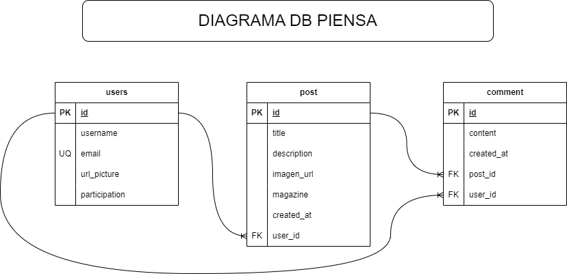

# TAS14 - AVANCE PIENSA

### INTREGANTES

- VICTORIA QUINDE
- ALEXIS NAREA 
- LIZBETH ENCALADA 
### 1. - DIAGRAMA PIENSA
---

- Captura



### 2. - DLL DB PIENSA
---
- Sentencia:
```
-- tabla users
CREATE TABLE users(
 id SERIAL,
 username VARCHAR (50) NOT NULL,
 email VARCHAR (50) UNIQUE NOT NULL,
 url_picture VARCHAR (50),
 participation VARCHAR (50),
 PRIMARY KEY (id)
);

-- tabla post
CREATE TABLE post (
 id SERIAL,
 title VARCHAR (50) NOT NULL,
 description TEXT,
 image_url TEXT,
 magazine VARCHAR (50) NOT NULL,
 created_at TIMESTAMP DEFAULT CURRENT_TIMESTAMP,
 user_id INT NOT NULL,
 PRIMARY KEY (id),
 FOREIGN KEY (user_id) REFERENCES users(id)
);

-- tabla comment
CREATE TABLE comment (
 id SERIAL,
 content VARCHAR (50),
 created_at TIMESTAMP DEFAULT CURRENT_TIMESTAMP,
 user_id INT not null,
 post_id INT not null,
 FOREIGN KEY (user_id) REFERENCES users(id),
 FOREIGN KEY (post_id) REFERENCES post(id)
);
```
### 3. - VIEW DB PIENSA
---
- Sentencia:
```
CREATE VIEW post_comments AS
SELECT 
    p.id AS post_id,
    p.title AS post_title,
    c.id AS comment_id,
    c.content AS comment_content,
    u.username AS commenter_username,
    c.created_at AS comment_created_at
FROM 
    post p
JOIN 
    comment c ON p.id = c.post_id
JOIN 
    users u ON c.user_id = u.id;
```
### 4. - TRIGGER DB PIENSA 
---
- Sentencia:
```
-- Función que actualiza el campo created_at de la tabla comment
CREATE OR REPLACE FUNCTION update_comment_timestamp()
RETURNS TRIGGER AS $$
BEGIN
    NEW.created_at := CURRENT_TIMESTAMP;
    RETURN NEW;
END;
$$ LANGUAGE plpgsql;

--trigger que actualiza el campo created_at antes de insertar un nuevo comentario
CREATE TRIGGER set_comment_timestamp
BEFORE INSERT ON comment
FOR EACH ROW
EXECUTE PROCEDURE update_comment_timestamp();

```
